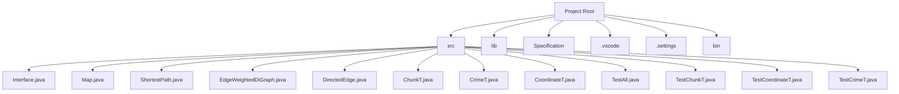

# Safety Net

## Overview
Safety Net is a desktop application designed to map crime data to different regions of New York City using NYPD arrest data. The application provides valuable insights for tourists and real estate investors by allowing them to filter for specific crimes in designated areas of NYC. It helps users identify safe areas to stay and provides information on crime frequency and types in different boroughs of NYC.

## Features
- **Crime Frequency Comparison**: Compare crime frequency and types of crime between the boroughs of NYC.
- **Time Period Comparison**: Compare crime data during different time periods.
- **Location Lookup**: Get crime data at a specific address.
- **Safest Path**: Find the safest path between two areas of the city using Dijkstra's shortest path algorithm.

## Project Structure

## Installation
1. Clone the repository:
2. Set up the environment:
    - Ensure you have Java SE 10 installed.
    - Install the required libraries:
      - `opencsv-5.1.jar`
      - `gson-2.6.2.jar`
      - `commons-lang3-3.10.jar`
3. Build the project:
    - Open the project in your preferred IDE (e.g., Eclipse, IntelliJ IDEA).
    - Build the project to resolve dependencies.

## Usage
1. Run the application:
    - The application's entry point is the main method in the `Interface` class.
    - Run the `Interface.java` file to start the application.
2. Interact with the application:
    - Follow the on-screen prompts to select options and perform various queries.

## Classes and Modules

### Interface
The `Interface` class serves as the entry point and user interface for the application. It allows users to interact with the `Map` and `ShortestPath` modules to perform various queries.

### Map
The `Map` class functions as the model where all logical processes occur. It provides methods for various queries, including obtaining the safest/least safe neighborhoods, most/least occurring crimes, crimes within a specific radius, and the safest path between neighborhoods.

### ShortestPath
The `ShortestPath` class implements Dijkstra's shortest path algorithm to find the safest path between two points based on the number of crimes committed in each neighborhood.

### EdgeWeightedDiGraph
The `EdgeWeightedDiGraph` class represents an edge-weighted directed graph with neighborhood connections. The vertices are neighborhoods, and the edges are paths between neighborhoods with weights representing the number of crimes.

### DirectedEdge
The `DirectedEdge` class represents a directed edge in the graph, with vertices as strings and weights as integers.

### ChunkT
The `ChunkT` class represents a neighborhood and contains information about crimes committed within its boundaries. It includes methods for adding crimes, retrieving crime data, and checking if a crime occurred within the chunk.

### CrimeT
The `CrimeT` class represents a crime and contains information about the date, description, and location of the crime. It implements the `Comparable` interface to compare crimes by date.

### CoordinateT
The `CoordinateT` class represents coordinates using latitude and longitude. It includes methods for retrieving coordinates and calculating the distance between two coordinates.

## Testing
The project includes unit tests for various classes:
- `TestChunkT`
- `TestCoordinateT`
- `TestCrimeT`

To run the tests, use a testing framework like JUnit.

## License
This project is licensed under the MIT License. See the LICENSE file for details.

## Acknowledgements
- **OpenCSV**: For CSV parsing.
- **Gson**: For JSON parsing.
- **LocationIQ**: For geocoding API.

## Contact
For any questions or inquiries, please contact the project maintainers.

This documentation provides a comprehensive overview of the Safety Net project, including its features, installation instructions, usage guidelines, and details about the various classes and modules.

